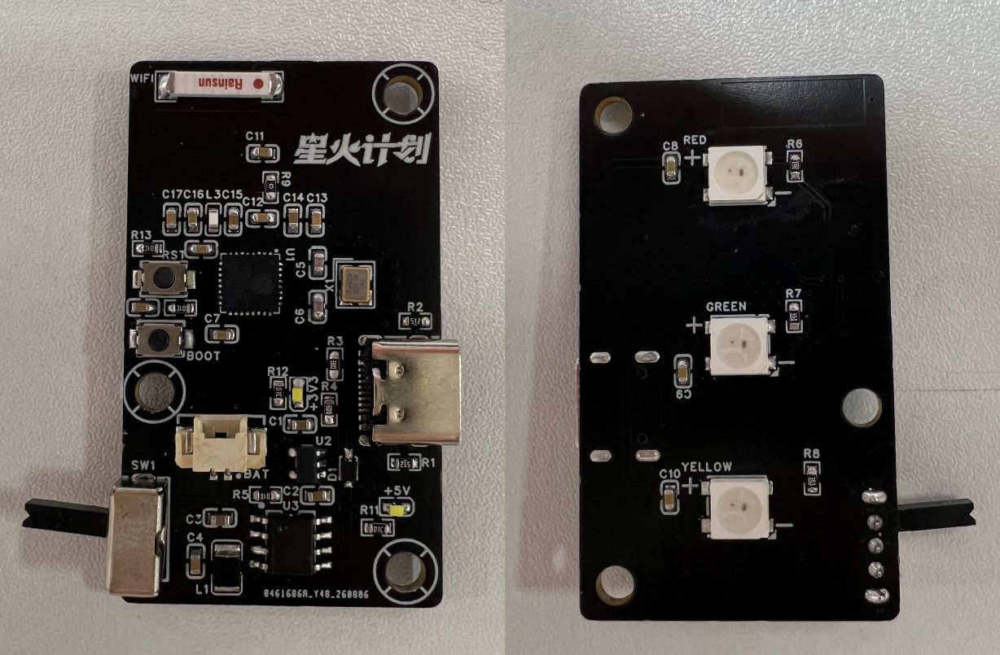

# CodexLight Hardware

[项目主页](../README.md) | [Project Home](../README.en.md)

本目录包含 CodexLight 的 BOM、原理图、PCB 源工程、Gerber、贴片坐标文件和 3D 打印外壳。

This directory contains the CodexLight bill of materials, schematic, PCB source project, Gerber files, component placement list, and 3D-printable enclosure.

## Files / 文件

| Path | Description |
| --- | --- |
| `BOM/BOM.xls` | 物料清单 / Bill of materials |
| `Schematic/Schematic.pdf` | 原理图 PDF / Schematic PDF |
| `PCB/Source/CodexLight.epro2` | PCB 源工程 / PCB source project |
| `PCB/Gerber/CodexLight_PCB_Gerber.zip` | Gerber 制造包 / Gerber fabrication package |
| `PCB/Assembly/CodexLight_PCB_CPL.csv` | 元件贴片坐标文件 / Component placement list |
| `Enclosure/CodexLight_T.stl` | 上壳 / Top enclosure |
| `Enclosure/CodexLight_B.stl` | 下壳 / Bottom enclosure |

## LED Connections / LED 连接

| LED | GPIO |
| --- | --- |
| Yellow WS2812B DIN / 黄灯 DIN | GPIO5 |
| Green WS2812B DIN / 绿灯 DIN | GPIO6 |
| Red WS2812B DIN / 红灯 DIN | GPIO7 |

三颗 LED 使用独立数据线，不是串联灯带。LED 电源和 ESP32-C3 必须共地，并使用稳定 5 V 供电。

The three LEDs use independent data lines, not a chained strip. The LED supply and ESP32-C3 must share ground, and a stable 5 V supply is required.

## Assembly Photo / 焊接实物

图片展示当前一体化主板正反面的焊接结果，包括主控、射频、USB、电池管理、稳压和三颗状态灯区域。

The image shows the assembled front and back sides of the current all-in-one board, including the MCU, RF, USB, battery-management, regulator, and status-LED sections.

## Standalone Power / 独立供电

纯无线使用时，可以通过 Type-C/稳定 5 V 电源供电，也可以从 MX1.25 接口接入带保护的单节锂电池。ETA6093S2F 负责单节锂电池开关充电和 5 V 同步升压，TLV75733PDBVR 再生成 ESP32-C3FH4 使用的 3.3 V。接入电池前必须核对接口极性。

For wireless-only use, power the device through USB Type-C or a stable 5 V supply, or connect a protected single-cell Li-ion battery through MX1.25. The ETA6093S2F handles switch-mode charging and synchronous 5 V boost power, while the TLV75733PDBVR generates 3.3 V for the ESP32-C3FH4. Verify battery connector polarity before connection.

## Notes / 注意

- 固件默认使用 `NEO_GRB + NEO_KHZ800`。
- 如果更换不同批次 WS2812B 后颜色不对，请检查色序、DIN 方向、焊接和供电。
- 固件烧录和首次 Wi-Fi 配网需要可传输数据的 Type-C 线。
- ETA6093S2F 的 `LED` 引脚通过 R5（1 kΩ）驱动 LED1、LED2；L1 为 2.2 µH，+5 V 输出端 C4 为 22 µF，电池侧 C3 为 10 µF。电池应带保护电路并核对接口极性。
- 当前 `BOM.xls` 和 `CodexLight_PCB_CPL.csv` 仍包含旧的 ETA9697E8A 记录，正式生产前需要从新版 EasyEDA 工程重新导出并核对封装、坐标和旋转方向。
- `CodexLight_PCB_CPL.csv` 包含顶层和底层元件坐标；提交贴片订单前应在生产平台预览并核对元件层、坐标和旋转方向。

- Firmware defaults to `NEO_GRB + NEO_KHZ800`.
- If another WS2812B batch displays incorrect colors, verify pixel order, DIN orientation, soldering, and power.
- Firmware upload and first-time Wi-Fi provisioning require a data-capable USB Type-C cable.
- The ETA6093S2F `LED` pin drives LED1 and LED2 through R5 (1 kΩ). L1 is 2.2 µH, C4 is 22 µF on the +5 V output, and C3 is 10 µF on the battery side. Use a protected battery and verify connector polarity.
- The current `BOM.xls` and `CodexLight_PCB_CPL.csv` still contain the previous ETA9697E8A entry. Re-export them from the updated EasyEDA project and verify the footprint, coordinates, and rotation before production.
- `CodexLight_PCB_CPL.csv` contains top- and bottom-side component coordinates. Preview the assembly order and verify layer, position, and rotation data before production.

## License

Unless a third-party component states otherwise, hardware files follow the repository [MIT License](../LICENSE).
