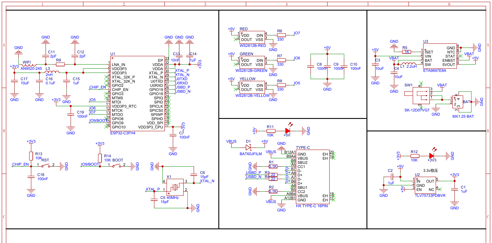
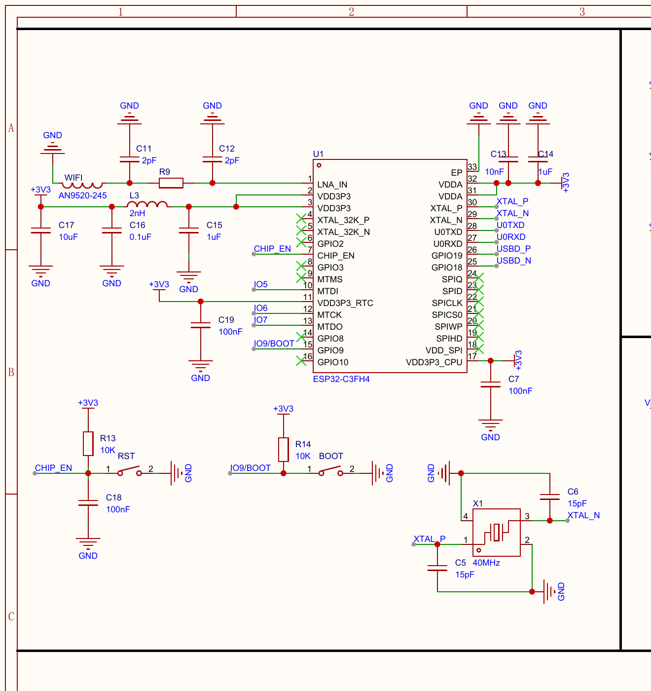
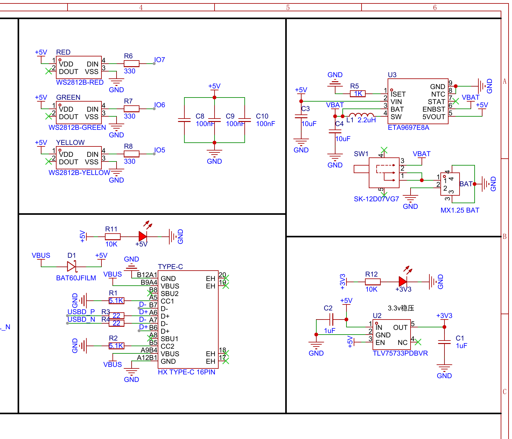

# CodexLight

[English](README.en.md) | 简体中文 | [使用说明](USAGE.md) | [English Usage Guide](USAGE.en.md)

CodexLight 是一套基于 ESP32-C3FH4 的 Codex Desktop 状态灯。Windows 端 Bridge 读取本机 Codex 会话日志，把状态转换为 `GREEN`、`RED`、`YELLOW`，再通过 USB 串口、局域网 UDP 或两者同时发送给状态灯。固件驱动三颗独立 WS2812B LED 显示空闲、工作和等待状态。

硬件采用一体化主板设计，集成 ESP32-C3FH4、2.4 GHz 天线、40 MHz 晶振、Type-C 原生 USB、电池充电与 5 V 升压以及 3.3 V 稳压电路，不需要额外安装 ESP32-C3 开发板。

本项目是社区开源项目，与 OpenAI 没有官方关联或背书。

## 当前可用方案

- 配网使用 USB 串口，不再使用 ESP32 AP 热点页面。
- 托盘程序提供 `Configure WiFi`，通过 USB 把 SSID 和密码发送给设备。
- Wi-Fi 只在连接成功后写入 ESP32 NVS；错误密码不会覆盖旧配置。
- 已保存的 Wi-Fi 会在开机后非阻塞连接，并在断线后持续重试。
- ESP32-C3 使用 SDK 默认的 Wi-Fi 发射功率，由 PHY 和地区配置决定。
- 无电脑供电启动不依赖 USB 串口，可使用板载电池接口或稳定 5 V 电源进行纯无线摆放。
- 支持 `AUTO`、`WIRED`、`WIRELESS` 三种持久化通信模式。
- `Bridge/start_codex_light_tray.vbs` 默认以无线模式隐藏启动，不保留 PowerShell 窗口。

## 状态定义

| 状态 | Codex 条件 | LED | GPIO |
| --- | --- | --- | --- |
| `GREEN` | 空闲、任务完成或任务中止 | 绿灯 | GPIO6 |
| `RED` | 正在思考、回复、运行工具或处理任务 | 红灯 | GPIO7 |
| `YELLOW` | 等待审批、权限确认或用户输入 | 黄灯 | GPIO5 |
| 未收到电脑心跳 | 6 秒内没有有效 USB/UDP 心跳 | 黄灯慢闪 | GPIO5 |

Bridge 兼容 Codex 会话日志中的普通工具调用和自定义工具调用事件，因此系统权限审批、沙箱授权和显式用户输入等待都能进入黄色状态。

首次收到有效电脑心跳时，绿灯会闪烁 2 秒作为连接提示，然后显示真实状态。任务完成后的绿色会保持到下一次任务开始、进入等待状态或连接断开。

## 快速开始

1. 安装电脑端依赖：

   ```powershell
   python -m pip install pyserial
   ```

2. 编译并烧录固件：

   ```powershell
   cd Firmware
   pio run
   pio run -t upload --upload-port COM4
   ```

3. 双击启动隐藏托盘，默认进入无线模式：

   ```text
   Bridge\start_codex_light_tray.vbs
   ```

4. 第一次使用时，用可传输数据的 Type-C 线连接设备，右键托盘图标选择 `Configure WiFi`，输入路由器 SSID 和密码。
5. Wi-Fi 保存成功后，可以拔掉电脑 USB，改用稳定 5 V 电源或从 MX1.25 接口接入的受保护单节锂电池供电；托盘会通过 UDP 控灯。

完整流程见 [USAGE.md](USAGE.md)。

## 纯无线使用

1. 先用 USB 完成一次 `Configure WiFi`。
2. 确认托盘模式是 `Wireless only`，或用默认 `start_codex_light_tray.vbs` 启动。
3. 断开电脑 USB，使用稳定 5 V 电源或从 MX1.25 接口接入的受保护单节锂电池给整机供电。
4. 打开托盘后，日志应出现：

   ```text
   SERIAL no matching serial port
   SERIAL setup skipped; using saved firmware mode.
   UDP ack from 192.168.x.x CODEXLIGHT/1 ACK ... active=WIRELESS state=...
   ```

这表示设备未接电脑串口，但已通过 Wi-Fi UDP 正常工作。

## 无串口诊断灯码

| 灯码 | 含义 |
| --- | --- |
| 红黄交替 | 没有读到 Wi-Fi 配置，需要 USB 配网 |
| 红色双闪循环 | 有 Wi-Fi 配置，但正在重连或连接失败 |
| 黄灯慢闪 | Wi-Fi 已连接，正在等待电脑托盘 UDP 心跳 |
| 正常红/绿/黄 | 已收到电脑状态，系统正常工作 |

## 硬件



当前硬件是围绕 ESP32-C3FH4 设计的一体化主板，完整原理图见 [Hardware/Schematic/Schematic.pdf](Hardware/Schematic/Schematic.pdf)。

| 功能模块 | 主要器件与连接 |
| --- | --- |
| 主控与时钟 | ESP32-C3FH4，外接 40 MHz 晶振；RST 接 CHIP_EN，BOOT 接 GPIO9 |
| 无线射频 | AN9520-245 2.4 GHz 天线，R9/C11/C12 预留射频匹配网络 |
| USB Type-C | 原生 USB D+/D- 分别连接 GPIO19/GPIO18，并串联 22 Ω；CC1、CC2 各使用 5.1 kΩ 下拉 |
| USB 供电 | VBUS 经 BAT60JFILM 肖特基二极管接入系统 +5 V |
| 电池供电 | ETA9697E8A 负责单节电池线性充电和 5 V 升压，使用 2.2 µH 电感、MX1.25 电池接口和电源开关 |
| 3.3 V 电源 | TLV75733PDBVR 将 +5 V 稳压为 +3.3 V，为 ESP32-C3FH4 和逻辑电路供电 |
| 状态灯 | 黄灯 GPIO5、绿灯 GPIO6、红灯 GPIO7；每路串联 330 Ω，并配置 100 nF 去耦电容 |

<p>
  
  
</p>

左图为 ESP32-C3FH4 主控、射频、晶振及 RST/BOOT 电路，右图为三路状态灯、Type-C、电池管理和 3.3 V 稳压电路。

三颗 WS2812B 使用三路独立数据输入，不是串联灯带。灯珠使用 +5 V 供电，ESP32-C3FH4 使用 +3.3 V 供电，二者必须共地。当前固件使用 `NEO_GRB + NEO_KHZ800`，默认亮度为 `DEFAULT_BRIGHTNESS = 50`，可在 [Firmware/include/config.h](Firmware/include/config.h) 中配置。

原理图中 ETA9697E8A 的 NTC 和 STAT 没有外接温度检测或状态指示。电池必须核对接口极性并带有保护电路，充电电流应根据 R5 和所用电池容量核算。更详细的电路说明和组装注意事项见 [开源平台项目说明](Docs/立创开源平台项目说明.md)。

## 目录结构

```text
CodexLight/
├── Bridge/        # Windows 日志监听、串口/UDP 发送和托盘程序
├── Firmware/      # ESP32-C3 PlatformIO 固件
├── Hardware/      # BOM、原理图、PCB、Gerber、贴片坐标、外壳 STL
├── Docs/          # 使用与实现说明
├── README.md      # 中文项目说明
├── README.en.md   # English project documentation
├── USAGE.md       # 中文使用手册
└── USAGE.en.md    # English usage guide
```

## 验证

```powershell
python -B -m py_compile Bridge\codex_light_monitor.py
powershell -NoProfile -Command "$e=$null; [System.Management.Automation.PSParser]::Tokenize((Get-Content -LiteralPath 'Bridge\CodexLightTray.ps1' -Raw), [ref]$e) | Out-Null; if($e){$e; exit 1}else{'OK'}"
cd Firmware
pio run
```

## 许可

本项目使用 [MIT License](LICENSE)。第三方依赖遵循各自许可。
